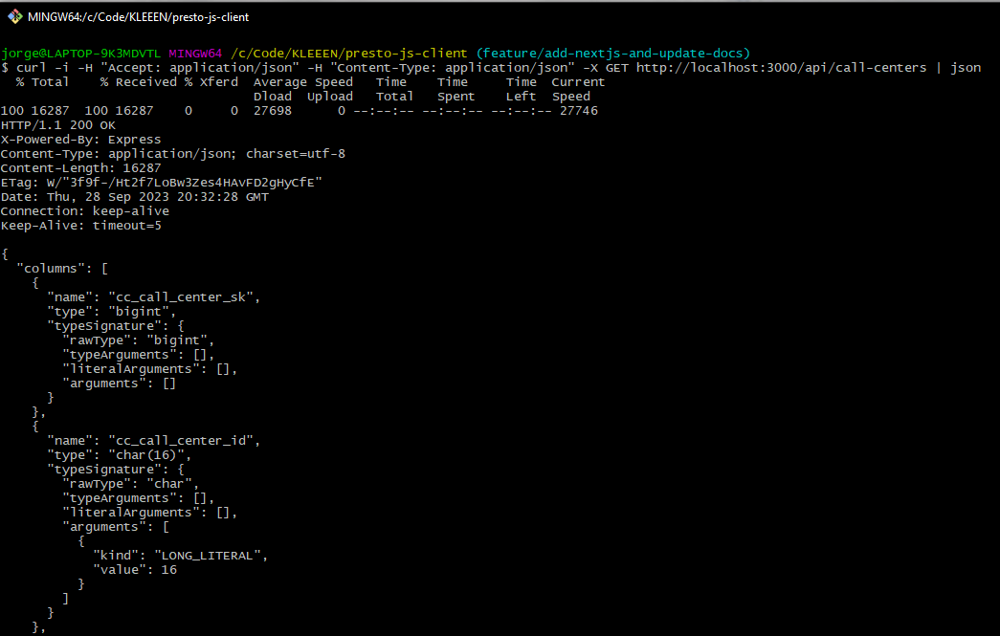

# NestJS Application

This is an example application to showcase how to use the Presto JS Client. Look at the app service file (src/app/app.service.ts) to see how to use the client for several different operations, and how to handle the results as well as the errors.

## Running the Application

To run this application, follow these steps:

1. Start a local Presto instance using `docker-compose` by running the following command:

   ```bash
   npm run presto:up
   ```

2. Once the Presto instance is up and running, you can start the Nest Server by running:

   ```bash
   npm run serve nest-server
   ```

3. After starting the Nest Server, you can make a `GET` request to the following endpoint to see the response from querying the local Presto container using the `prestodb-js-client` library:

   ```
   curl -i -H "Accept: application/json" -H "Content-Type: application/json" -X GET http://localhost:3000/api/query-test | json
   ```

   Output:

   

Make sure you have all the necessary dependencies installed and configured before running the commands above.
